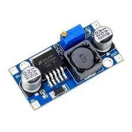
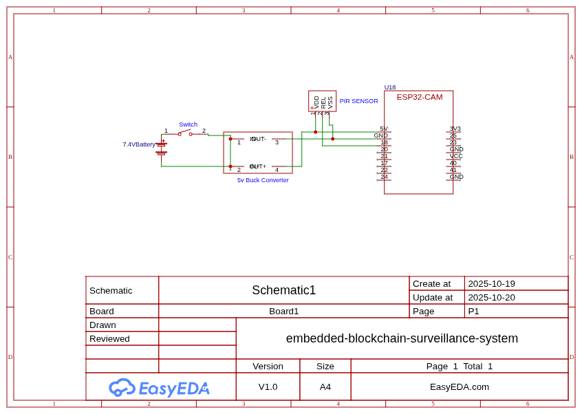

# System Images

This page displays visual representations of the Embedded Blockchain Surveillance System components, including individual hardware components, the system schematic, and the coupled system implementation.

## Individual Components

### ESP32-CAM Microcontroller

*The main controller with integrated camera module for capturing surveillance footage.*

### PIR Motion Sensor

*Passive infrared sensor used to detect motion and trigger video recording.*

### Slide Switch

*Main power switch for controlling the entire system's power state.*

### LM2596 DC-DC Buck Converter

*LM2596 DC-DC buck converter that steps down 7.4V battery voltage to 5V for the ESP32-CAM.*

## System Diagrams

### Circuit Schematic

*Complete circuit diagram showing the connections between all components in the Embedded Blockchain Surveillance System.*

### Coupled System Implementation

*Actual implementation of the coupled system showing all components connected and working together.*