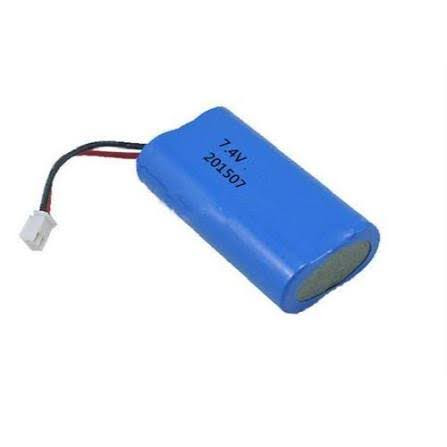
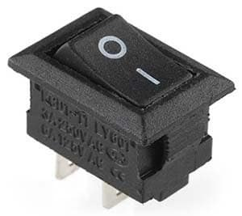
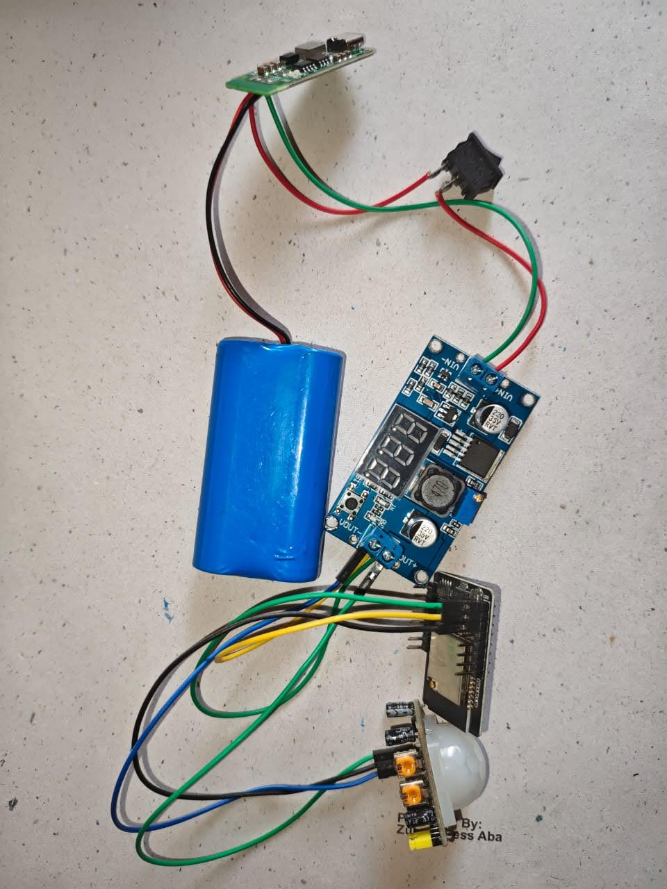

# Materials: Hardware

This section details the hardware materials used in the implementation of the Embedded Blockchain Surveillance System, including IoT devices and sensors that form the surveillance network. Visual representations of these components can be found in the [System Images](/project-report/images) section.

## IoT Surveillance Devices

### ESP32-CAM Microcontroller

*The primary hardware component of the surveillance system*

The primary hardware component of the surveillance system is the ESP32-CAM microcontroller, which provides:

- **Core Processor**: ESP32 dual-core microcontroller with built-in Wi-Fi connectivity
- **Integrated Camera**: OV2640 camera module capable of capturing VGA to UXGA resolution images
- **Memory**: PSRAM for image processing and temporary storage
- **Connectivity**: Built-in Wi-Fi for communication with the cloud server
- **GPIO Pins**: Multiple general-purpose input/output pins for sensor integration
- **Low Power Consumption**: Optimized for continuous operation in surveillance applications

#### Technical Specifications:
- Processor: Xtensa LX6 dual-core microprocessor
- Clock Speed: Up to 240MHz
- RAM: 520KB SRAM
- PSRAM: 8MB PSRAM (on most models)
- Camera: OV2640, 2MP, supports JPEG compression
- Connectivity: Wi-Fi 802.11 b/g/n
- Operating Voltage: 3.3V
- Current Consumption: 80mA in active mode, 10uA in deep sleep

### Integration Capabilities
- **Camera Interface**: Direct camera connection for image capture
- **Sensor Ports**: Multiple GPIO pins for connecting motion and other sensors
- **Power Management**: External power supply or battery operation
- **Storage**: MicroSD card slot for local image storage (optional)

## Motion Detection Sensors

### PIR (Passive Infrared) Sensors

*Detects motion and triggers the surveillance recording process*

PIR sensors are used to detect motion and trigger the surveillance recording process:

- **Detection Angle**: 110-degree wide-angle lens for comprehensive coverage
- **Operating Voltage**: 3.3V to 5V (compatible with ESP32-CAM)
- **Power Consumption**: Low power consumption for continuous monitoring
- **Output Signal**: Digital HIGH when motion is detected
- **Re-triggering**: Configurable re-triggering modes (repeat/non-repeat)
- **Communication Method**: Digital signal output connected to GPIO pins on ESP32-CAM (not UART - uses simple digital I/O interface)

#### Key Features:
- **Passive Technology**: Detects infrared radiation from moving objects
- **Low Power**: Ideal for battery-powered applications
- **Weather Resistant**: Suitable for indoor and outdoor use
- **Adjustable Sensitivity**: Sensitivity can be adjusted based on surveillance needs
- **Delay Time**: Adjustable delay time before deactivation
- **Simple Interface**: Connects directly to ESP32-CAM GPIO pins for digital signal reading

## Power Management Components

### 7.4V 40000mAh Li-ion Battery

*40000mAh rechargeable Li-ion battery providing extended surveillance operations*

The primary power source for the surveillance system is a high-capacity 7.4V 40000mAh Li-ion Battery (2S configuration) which provides:

- Extended operational time for continuous surveillance (approximately 3-4 days of continuous operation)
- Rechargeable via external charging circuitry
- Stable power delivery for all system components
- Weather-resistant housing for outdoor deployment

### LM2596 DC-DC Buck Converter

*Steps down 7.4V battery voltage to 5V for ESP32-CAM operation*

The LM2596 DC-DC Buck Converter is used to:

- Step down the 7.4V battery voltage to the required 5V for ESP32-CAM operation
- Provide efficient DC-DC conversion with minimal power loss
- Maintain stable voltage output throughout the battery discharge cycle
- Include built-in protection mechanisms for overcurrent and overheating

### Slide Switch

*Main power switch for controlling the entire system*

A slide switch serves as the main power switch for the entire system:

- Allows manual on/off control of the surveillance system
- Completely disconnects power when switched off to conserve battery
- Integrated into the power circuit for easy access
- Durable construction for reliable operation in field conditions

## Connectivity Hardware

### Network Interface
- **Built-in Wi-Fi**: 802.11 b/g/n compatible with 2.4GHz networks
- **Antenna Options**: 
  - PCB antenna (integrated)
  - External antenna connector (on some models)
- **Network Configuration**: Supports both infrastructure and soft-AP modes

### Communication Protocols
- **HTTP/HTTPS**: For communication with cloud server
- **MQTT**: Optional lightweight protocol for IoT communications
- **WebSocket**: For real-time communication (if required)

## Mounting and Enclosure Materials

### Weatherproof Enclosures
For outdoor deployment, the system utilizes:

- **IP65/IP66 Rated Enclosures**: Protection against dust and water ingress
- **UV-Resistant Materials**: Polycarbonate or ABS plastic enclosures
- **Ventilation**: Heat dissipation for continuous operation
- **Mounting Brackets**: Secure installation options for walls, poles, etc.

### Installation Components
- **Mounting Hardware**: Screws, brackets, and fasteners for secure installation
- **Cable Management**: Conduits and ties for organized wiring
- **Grounding Components**: For electrical safety in outdoor installations

## Hardware Integration Architecture

### System Integration
The hardware components work together in the following architecture:

1. **PIR Sensor** detects motion and sends signal to ESP32-CAM
2. **ESP32-CAM** triggers camera to capture images at regular intervals
3. **Images** are processed and sent to cloud server via Wi-Fi
4. **Cloud Server** stores images on IPFS and records events on blockchain
5. **AI Processing** runs on cloud server to detect criminals in images
6. **Officials** are alerted if criminal detection occurs

### Power Flow
- 7.4V 40000mAh Li-ion Battery → LM2596 DC-DC Buck Converter → ESP32-CAM and Sensors
- Power management ensures stable operation of all components
- Low-power modes extend operational time for battery-powered deployments

### System Schematic

*Complete circuit diagram showing the connections between all components*

### Coupled System Implementation

*Actual implementation of the coupled system showing all components working together*

### IPFS Dashboard

*Dashboard showing the IPFS storage interface where surveillance videos are stored*

