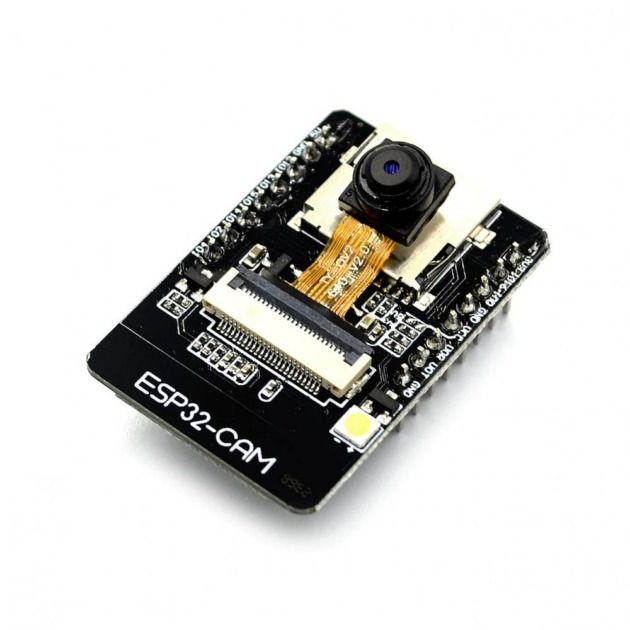
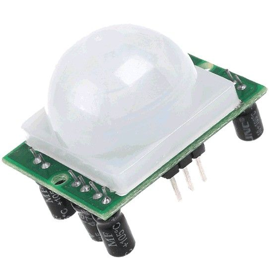
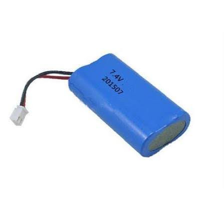
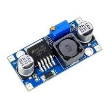
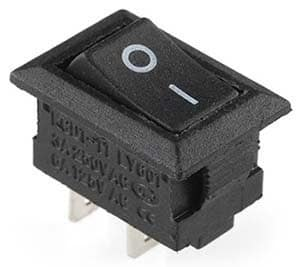
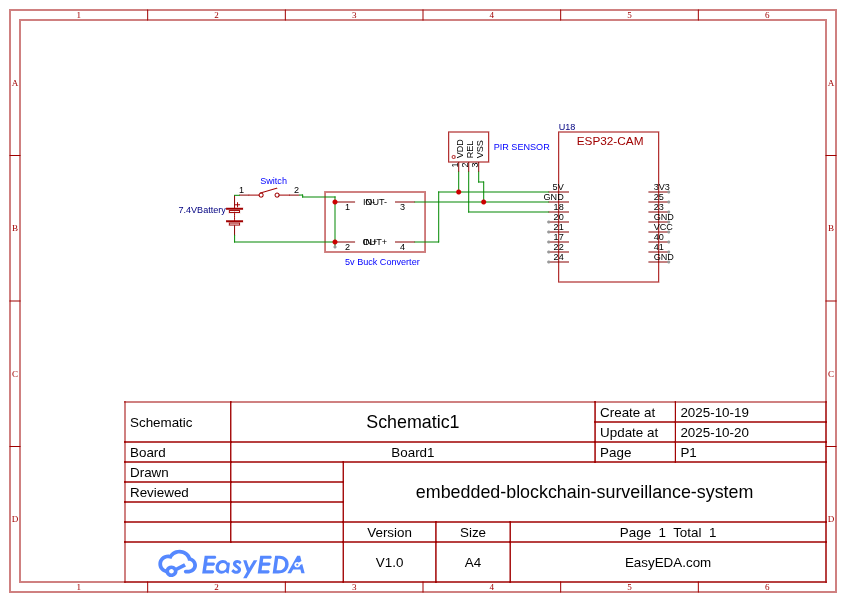
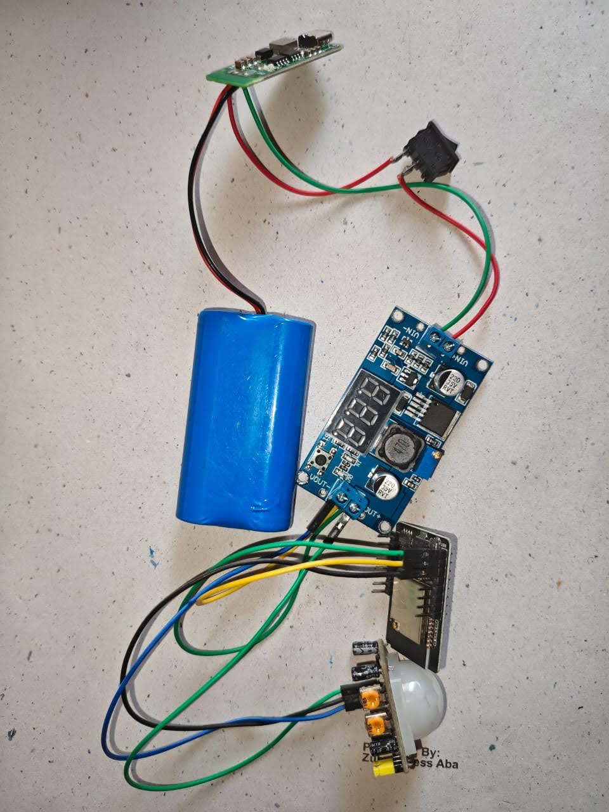
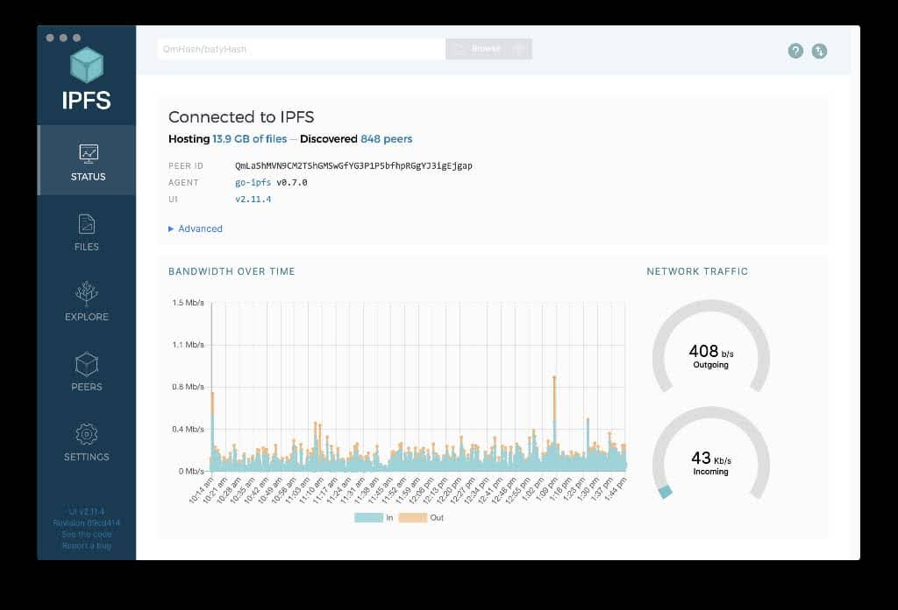

# Materials: Overview

This section provides a high-level overview of the materials used in the implementation of the Embedded Blockchain Surveillance System. The materials are categorized into software and hardware components that work together to create a comprehensive surveillance solution. Visual representations of these components can be found in the [System Images](/project-report/images) section.

## System Components Overview

The Embedded Blockchain Surveillance System combines multiple technologies to achieve its objectives:

### Software Infrastructure
- **Smart Contracts**: Built with Solidity and OpenZeppelin, deployed on Polygon blockchain
- **Cloud Backend**: Hono framework with IPFS integration and AI processing capabilities
- **Frontend Application**: React-based interface for officials to monitor surveillance sessions
- **AI Processing**: faceapi.js for criminal detection in video streams

### Hardware Components
- **IoT Surveillance Devices**: ESP32-CAM microcontrollers with integrated cameras
- **Motion Sensors**: PIR sensors for detecting movement and triggering recordings
- **Power Supply**: 7.4V 40000mAh Li-ion Battery for extended operation
- **Power Management**: LM2596 DC-DC Buck Converter for voltage regulation
- **System Control**: Slide switch for manual power control

### Infrastructure
- **Server Infrastructure**: 3.5GB VPS from Racknerd for cloud server deployment
- **Blockchain Network**: Polygon for cost-efficient and scalable transaction processing
- **Decentralized Storage**: IPFS via thirdweb gateway for secure video storage

## Technology Stack Summary

The system leverages a comprehensive technology stack designed to provide:

- **Decentralized Data Storage**: IPFS for video stream storage with blockchain verification
- **AI-Powered Detection**: Automated criminal identification using face detection
- **Real-Time Monitoring**: IoT devices with motion sensors providing continuous surveillance
- **Immutable Records**: Blockchain-based timestamping and event logging
- **Secure Access**: Role-based authentication and authorization for officials

## System Architecture Visualization

### Individual Components
Visual representations of individual hardware components:
-  - Main controller with integrated camera
-  - Detects motion and triggers recordings
-  - High-capacity power source for extended operation
-  - Voltage regulation component
-  - Manual power control component

### System Integration
-  - Complete circuit diagram showing component connections
-  - Actual implementation of all components working together
-  - Interface for decentralized video storage

## Cost Breakdown

### Hardware Components

| Category | Component | Function | Estimated Price (₦) |
|----------|-----------|----------|-------------------|
| Processing | ESP32-CAM | Main controller with dual-core processor, Wi-Fi, and integrated camera | 18,000 |
| Sensors | PIR Sensor | Detects motion using infrared radiation and sends digital signal to ESP32-CAM | 3,500 |
| Power | 7.4V 40000mAh Li-ion Battery | Primary power source providing extended operational time | 9,400 |
| Power | LM2596 DC-DC Buck Converter | Steps down 7.4V battery voltage to 5V for ESP32-CAM operation | 4,500 |
| Power | Slide Switch | Main power switch for the entire system | 100 |
| Connections | Jumper Wires | For connecting all components electrically | 2,500 |
| Housing | IP65/IP66 Enclosure | Weather-resistant housing for outdoor protection | 7,000 |

### Software and Infrastructure

| Category | Component | Function | Estimated Price (₦) |
|----------|-----------|----------|-------------------|
| Development Tools | Solidity, OpenZeppelin, Foundry | Smart contract development and testing tools | Free (Open Source) |
| Backend Framework | Hono | Web framework for cloud server API development | Free (Open Source) |
| IPFS Client | Helia | Decentralized storage client for video stream management | Free (Open Source) |
| AI Library | faceapi.js | Face detection and recognition for criminal identification | Free (Open Source) |
| Frontend Framework | React, Viem | User interface and blockchain interaction | Free (Open Source) |
| Cloud Infrastructure | 3.5GB VPS (Racknerd) | Monthly hosting for cloud server | ~15,000/month |
| Blockchain | Polygon Network | Gas fees for smart contract interactions | Variable (low cost) |
| IPFS Gateway | thirdweb | Decentralized storage access | Free tier available |
| Development Environment | VS Code, Git, Node.js, TypeScript | Development tools and runtime | Free (Open Source) |

## Total Estimated Cost

The total initial hardware cost is approximately **₦45,000**, with ongoing monthly infrastructure costs of about **₦15,000** for the VPS hosting. The software components are primarily open-source tools with minimal licensing costs.